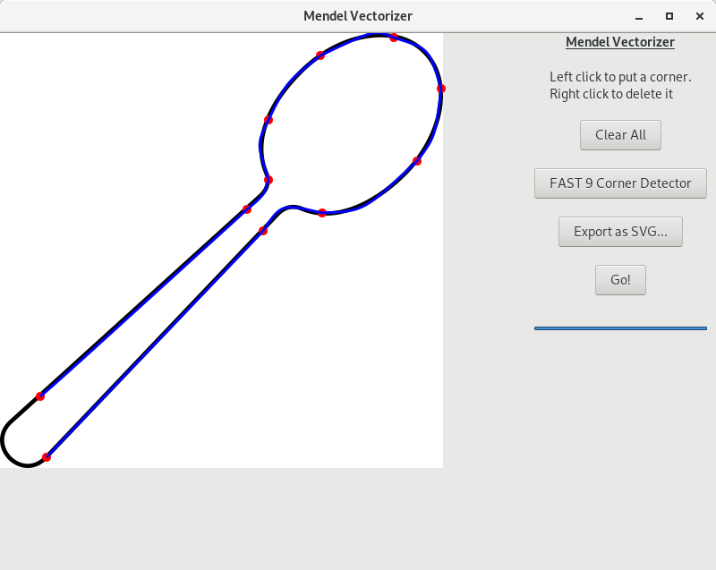

# Mendel Vectorizer



Licensed under GNU GPL v3

Transform your raster images (PNG, JPEG) into SVG. Set the corners and let the algorithm figure out a SVG that resembles the original image.

It uses a real coded genetic algorithm with bezier curves, see `docs` folder for the concrete algorithm.

# Usage

It need GTK3 libraries and a Rust 2018 compiler installed

```
sudo apt install libgtk-3-dev
git clone https://github.com/aarroyoc/mendel-vectorizer
cd mendel-vectorizer
cargo run
(or)
cargo run -- FILE
```


# Build docs

```
latexmk -c (clean)
latexmk -pdf
```
